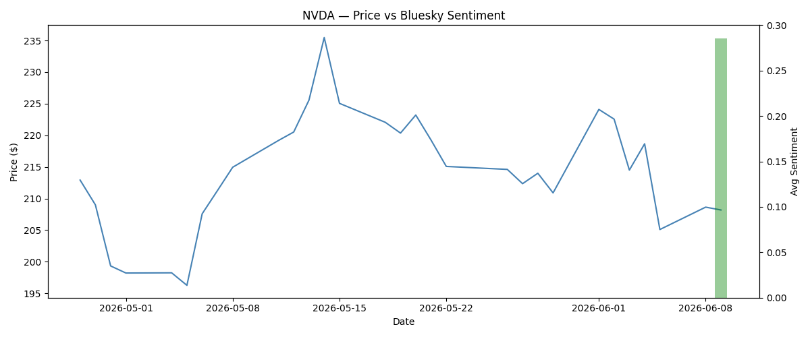

# Bluesky Sentiment Analysis

Fetches posts from [Bluesky](https://bsky.app) mentioning a given stock ticker,
scores them with a fine-tuned RoBERTa sentiment model, stores results in SQLite,
and plots sentiment alongside historical price data.

## Example Output



## Setup

**1. Clone the repo**
```bash
git clone https://github.com/yourusername/bluesky-sentiment-analysis.git
cd bluesky-sentiment-analysis
```

**2. Create a virtual environment**
```bash
python -m venv .venv
.venv\Scripts\activate  # Windows
source .venv/bin/activate  # Mac/Linux
```

**3. Install dependencies**
```bash
pip install -r requirements.txt
```

**4. Create a `.env` file in the project root**